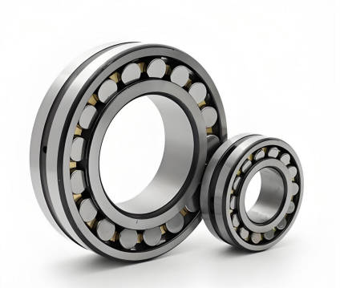

# CWRU-dignosis
Classification of vibration signals of faulty bearings based on CNN

## Introduction
This dataset is commonly used as a benchmark for bearing fault classification algorithms, which contains vibration signals recorded under various fault modes and operating conditions. The dataset classifies faults into three categories: inner race, outer race, and rolling element, with each category containing four distinct severity levels of $0.007$, $0.014$, $0.021$, and $0.028$ inches.
## Method
1. 1D CNNs have been successfully applied to fault classification based on signal data. The primary advantage of employing a 1D CNN is that manual feature extraction processes, such as spectrum analysis and statistical feature computation, are not required. Following normalization, the signal data can be fed directly into the 1D CNN for training.
2. Vibration signals generated by rolling bearing failures typically exhibit nonlinear and non-stationary characteristics. Compared to conventional time-domain and frequency-domain approaches, time-frequency analysis methods are more effective in processing these complex signals. One-dimensional fault data is transformed into images for classification.

